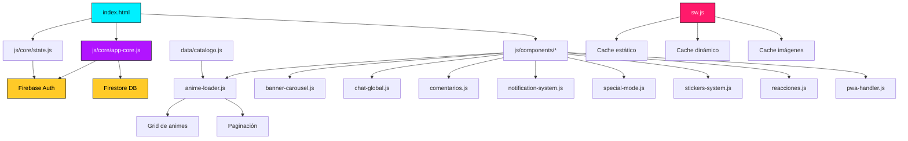

<div align="center">

<!-- ═══════════════════════════════════════════════════════
     BANNER PRINCIPAL
═══════════════════════════════════════════════════════ -->


<!-- ═══════════════════════════════════════════════════════
     TÍTULO ANIMADO
═══════════════════════════════════════════════════════ -->
<a href="https://archinime.pages.dev/" target="_blank">
  
</a>

<!-- ═══════════════════════════════════════════════════════
     BOTÓN PRINCIPAL — DEMO EN VIVO
═══════════════════════════════════════════════════════ -->
<br>

<a href="https://archinime.pages.dev/" target="_blank">
  
</a>

<br><br>

<!-- ═══════════════════════════════════════════════════════
     BADGES DE ESTADO
═══════════════════════════════════════════════════════ -->


<br>


<br><br>

<!-- ═══════════════════════════════════════════════════════
     MÚSICA DE FONDO
═══════════════════════════════════════════════════════ -->
<a href="https://cdn.jsdelivr.net/gh/Archinime/Archivos-data@main/Nightcore%20-%20Monster%20%5BNMV%5D.mp3" target="_blank">
  
</a>

<sub><i>▶️ Se abre en una nueva pestaña</i></sub>

<br><br>

<!-- ═══════════════════════════════════════════════════════
     FRASE MOTIVACIONAL
═══════════════════════════════════════════════════════ -->


</div>

---

## 📑 Índice

- [🌌 Sobre el Proyecto](#-sobre-el-proyecto)
- [✨ Características](#-características)
- [🎬 Capturas de Pantalla](#-capturas-de-pantalla)
- [🛠️ Stack Tecnológico](#️-stack-tecnológico)
- [🏗️ Arquitectura](#️-arquitectura)
- [📂 Estructura del Proyecto](#-estructura-del-proyecto)
- [🚀 Instalación Local](#-instalación-local)
- [🎮 Guía de Uso](#-guía-de-uso)
- [🔐 Reglas de Firestore](#-reglas-de-firestore)
- [📊 Estadísticas](#-estadísticas)
- [🗺️ Roadmap](#️-roadmap)
- [🤝 Contribuciones](#-contribuciones)
- [📄 Licencia](#-licencia)
- [👤 Autor](#-autor)

---

## 🌌 Sobre el Proyecto

<div align="center">
  
</div>

**Archinime** es una plataforma de streaming de anime **independiente y auto-gestionada** con una identidad visual **cyberpunk** única. No es solo un catálogo: es un ecosistema completo con chat comunitario en tiempo real, sistema de notificaciones inteligente, votaciones, reproductor multipropósito y una experiencia de usuario que rivaliza con plataformas comerciales.

Todo está construido con **JavaScript puro + Firebase**, sin frameworks pesados, priorizando el rendimiento y la elegancia del código.

> 💡 **Filosofía del proyecto:** El anime merece una interfaz tan emocionante como las historias que reproduce.

### 🎯 ¿Por qué Archinime?

| Aspecto | Descripción |
|---|---|
| 🎨 **Diseño único** | Interfaz cyberpunk con neones, partículas y efectos visuales personalizados |
| ⚡ **Sin frameworks** | JavaScript vanilla para máximo rendimiento y control |
| 💬 **Comunidad viva** | Chat global, reacciones y stickers personalizables |
| 📱 **PWA nativa** | Instalable en Android/iOS como una app real |
| 🔄 **Actualizaciones en caliente** | Service Worker versionado que invalida caché automáticamente |
| 📦 **Catálogo masivo** | +160 animes con temporadas, OVAs, películas y múltiples servidores |

---

## ✨ Características

### 🎬 Reproducción y Catálogo

- **163 animes** organizados por título, con búsqueda por nombre y alias
- **Múltiples temporadas / OVAs / Películas / Spin-Offs** por anime
- **Reproductor multi-servidor:** Google Drive, Dropbox, Catbox, Mp4Upload, PixelDrain, PlayMogo, Odysee, PeerTube, hubu.cloud
- **Marcador automático de episodios vistos** (sincronizado con Firestore o localStorage)
- **Navegación entre episodios** (anterior / siguiente)
- **Filtros avanzados:** género, demografía (Shōnen, Seinen, Shōjo, etc.) y ranking (S/A/B-tier)
- **Buscador con sugerencias en vivo** por título y alias

### 🎨 Interfaz y Experiencia

- **Loader animado** con GIFs rotativos y barra de progreso
- **Fondo con video galaxia** y partículas interactivas
- **Chroma key en vivo** con canvas (personajes flotantes)
- **Cursor personalizado** con efecto glow (solo escritorio)
- **Tema de color dinámico** en la barra del navegador
- **Animaciones fluidas** en todas las transiciones
- **Modo especial** con video de tráiler a pantalla completa (probabilidad configurable)

### 👤 Cuenta y Comunidad

- **Autenticación con Firebase:** Email/Password + Google
- **Perfil personalizable:** avatar, nombre público y **color neón** (con presets + paleta nativa)
- **Chat global en tiempo real** con panel lateral deslizante
- **Sistema de stickers:** subida a Catbox, robo entre usuarios, previews
- **Reacciones en comentarios** estilo Facebook (like, love, haha, wow, sad, angry)
- **Comentarios anidados** con respuestas, edición y reportes
- **Notificaciones inteligentes** con cola, límite por carga y badge dinámico
- **Votación de animes** con transacciones atómicas en Firestore

### 📱 PWA y Rendimiento

- **Service Worker versionado** (`SW_VERSION`) con invalidación automática
- **Estrategias de caché:** network-first para HTML/JS, stale-while-revalidate para imágenes
- **Instalable** en Android/iOS con icono personalizado
- **Soporte offline** para recursos precacheados
- **Push notifications** preparadas

---

## 🎬 Capturas de Pantalla

<div align="center">

> 📸 Un recorrido visual por la interfaz de **Archinime** — desde la portada hasta el reproductor.

</div>

### 🏠 Pantalla de Inicio

<div align="center">
  <a href="https://archinime.pages.dev/" target="_blank">
    
  </a>
</div>

> La pantalla principal con el **banner carrusel**, la **barra de búsqueda con sugerencias en vivo**, el **grid de animes** y todos los **filtros de género, demografía y ranking** en la parte superior.

<br>

### 📚 Catálogo de Animes

<div align="center">
  
</div>

> El **grid completo** con +160 animes. Cada tarjeta muestra la portada, el título y la calificación actual en estrellas. Se incluye **paginación** con navegación fluida y **efectos 3D** al pasar el cursor en escritorio.

<br>

### 🔔 Sistema de Notificaciones

<div align="center">
  
</div>

> Panel de **notificaciones inteligentes** con cola de popups, badge dinámico, historial persistente y sincronización con Firestore. Incluye alertas de **nuevos episodios**, **estrenos** y **respuestas a comentarios**.

<br>

### 💬 Chat Global

<div align="center">
  
</div>

> **Chat global en tiempo real** con panel lateral deslizante. Soporta mensajes de texto, **stickers personalizables** (imágenes y videos), colores neón por usuario y eliminación de mensajes propios.

<br>

### 🎥 Detalle del Anime

<div align="center">
  
</div>

> Vista de **detalle del anime** con portada, sinopsis, géneros, sistema de **votación por estrellas**, lista de **temporadas / OVAs / películas** con episodios marcables como vistos, y sección de **recomendaciones** basadas en el catálogo.

<br>

### 📺 Reproductor de Video

<div align="center">
  
</div>

> El **reproductor multipropósito** con:
> - Selector de **múltiples servidores** (Drive, Dropbox, PixelDrain, etc.)
> - **Bloqueador de logo** para evitar redirecciones
> - **Navegación entre episodios** (anterior / siguiente)
> - Sección completa de **comentarios con reacciones** y **stickers**
> - Botón de **descarga** con barra de progreso

<br>

### ⚡ Animaciones y Efectos Visuales

<div align="center">
  
</div>

> Los **efectos visuales únicos** de Archinime: partículas interactivas, **chroma key en vivo** con canvas, cursor personalizado con glow, animaciones fluidas de entrada y todos los detalles cyberpunk que hacen única la experiencia.

<br>

### 🏠 Habitación 3D Interactiva (Lunari OS)

<div align="center">
  <a href="https://archinime.pages.dev/pages/room.html" target="_blank">
    
  </a>
</div>

> Entorno **3D inmersivo** construido con **Three.js** y modelos de **Blender**.  
> Incluye controles interactivos de TV y PC, **sistema de clima sincronizado en tiempo real** según tu ubicación, e **inventario interactivo**.

---

## 🛠️ Stack Tecnológico

<div align="center">

### Frontend


### Backend y Datos


### Herramientas y Servicios


### Tipografía e Iconos


</div>

---

## 🏗️ Arquitectura

Archinime está diseñado con una **arquitectura modular** que separa responsabilidades y facilita el mantenimiento.



### 🔑 Conceptos clave

- **`state.js`** → Event bus centralizado con pub/sub para sincronizar el usuario autenticado entre módulos
- **`app-core.js`** → Inicialización de Firebase, lógica de autenticación y modal de perfil
- **`sw.js`** → Service Worker con `SW_VERSION` editable para invalidar caché sin tocar nada más
- **`catalogo.js`** → Fuente única de verdad con 163 animes y toda la metadata

---

## 📂 Estructura del Proyecto

```
Archinime/
│
├── 📄 index.html                 # Página principal
├── 📄 manifest.json              # Configuración PWA
├── 📄 sw.js                      # Service Worker v107
├── 📄 robots.txt                 # SEO
├── 📄 sitemap.xml                # SEO
├── 📄 google...html              # Verificación Google Search Console
├── 📄 README.md                  # Este archivo
│
├── 📁 assets/
│   ├── 📁 gifs/                  # GIFs del loader
│   ├── 📁 img/                   # Logos, avatares, fondos
│   ├── 📁 music/                 # 14 canciones de fondo
│   └── 📁 videos/                # 11 videos para efectos
│
├── 📁 css/
│   └── 📄 styles.css             # Estilos globales
│
├── 📁 data/
│   └── 📄 catalogo.js            # Catálogo con 163 animes
│
├── 📁 js/
│   ├── 📁 components/            # Módulos visuales
│   │   ├── 📄 anime-loader.js
│   │   ├── 📄 banner-carousel.js
│   │   ├── 📄 chat-global.js
│   │   ├── 📄 comentarios.js
│   │   ├── 📄 notification-system.js
│   │   ├── 📄 pwa-handler.js
│   │   ├── 📄 reacciones.js
│   │   ├── 📄 special-mode.js
│   │   └── 📄 stickers-system.js
│   │
│   ├── 📁 core/                  # Núcleo de la app
│   │   ├── 📄 app-core.js
│   │   ├── 📄 dompurify-config.js
│   │   └── 📄 state.js
│   │
│   ├── 📁 data/
│   │   └── 📄 users-data.js
│   │
│   ├── 📁 pages/                 # Lógica de páginas internas
│   │   ├── 📄 anime-detail-core.js
│   │   └── 📄 video-player-core.js
│   │
│   └── 📁 utils/                 # Utilidades
│       ├── 📄 animaciones.js
│       ├── 📄 gifs.js
│       └── 📄 musica_fondo.js
│
└── 📁 pages/                     # Páginas HTML internas
    ├── 📄 anime-detail.html
    ├── 📄 carga.html
    ├── 📄 opciones.html
    ├── 📄 proxy.html
    └── 📄 video-player.html
```

---

## 🚀 Instalación Local

### Requisitos previos

- Navegador moderno (Chrome, Firefox, Edge, Safari)
- Servidor local (por ejemplo `Live Server` en VS Code, o `python -m http.server`)

### Pasos

```bash
# 1. Clona el repositorio
git clone https://github.com/Archinime/-Archinime-.git
cd -Archinime-

# 2. Levanta un servidor local
# Opción A: con Python
python -m http.server 8000

# Opción B: con Node.js (si tienes npx)
npx serve

# Opción C: con Live Server de VS Code
# Solo abre index.html con la extensión activada
```

Luego abre **`http://localhost:8000`** en tu navegador.

> ⚠️ **Importante:** No abras `index.html` directamente con doble clic (`file://`). El Service Worker y varias funciones requieren un servidor.

---

## 🎮 Guía de Uso

### 👤 Para usuarios

1. **Explora** el catálogo desde la página principal
2. **Filtra** por género, demografía o ranking
3. **Busca** por nombre o alias con sugerencias en vivo
4. **Regístrate** (email, Google o GitHub) para desbloquear funciones
5. **Personaliza** tu perfil con avatar, nombre y **color neón**
6. **Comenta** y **reacciona** en cada episodio
7. **Sube stickers** y compártelos en el chat global
8. **Marca episodios** como vistos (se sincroniza entre dispositivos)
9. **Instala la PWA** desde el menú del navegador

### 🛠️ Para desarrolladores

#### Actualizar el catálogo

Edita `data/catalogo.js` con la estructura:

```javascript
{
  id: 123,
  title: "Nombre del Anime",
  img: "URL de portada",
  desc: "Sinopsis...",
  genres: ["Acción", "Aventura"],
  aliases: ["Nombre alternativo"],
  rating: 4.8,
  seasons: [
    {
      num: 1,
      name: "Temporada 1",
      cover: "URL de portada de temporada",
      eps: [
        {
          title: "Capítulo 1",
          link: "URL del servidor 1",
          link2: "URL del servidor 2"
        }
      ]
    }
  ],
  music: ["URL canción 1"]
}
```

#### Forzar actualización masiva del caché

Edita **solo** la constante en `sw.js`:

```javascript
const SW_VERSION = 'v108';  // ⬅️ Sube este número
```

Todos los usuarios recibirán la nueva versión en la siguiente carga.

#### Agregar un nuevo módulo

1. Crea el archivo en `js/components/mi-modulo.js`
2. Impórtalo en `index.html` con `<script src="...">`
3. Registra su inicialización en `js/core/app-core.js`

---

## 🔐 Reglas de Firestore

El proyecto usa reglas **granulares** con validación de tipos, tamaños y propietarios.

### Puntos clave

- ✅ Solo **admins** (por email) pueden escribir en `catalogo/`
- ✅ Solo el **dueño** puede leer/escribir su perfil en `users/`
- ✅ Comentarios con validación de longitud y formato
- ✅ Votos con **transacciones atómicas** y validación de rango (0–5)
- ✅ Chat global con restricciones de tamaño y sanitización
- ✅ Bloqueo global al final (`allow read, write: if false;`)

Para ver las reglas completas, revisa el archivo `firestore.rules` en el repositorio.

---

## 📊 Estadísticas

<div align="center">


<br><br>


<br><br>


</div>

---

## 🗺️ Roadmap

### ✅ Completado

- [x] Sistema de autenticación (Email + Google)
- [x] Catálogo con +160 animes
- [x] Reproductor multi-servidor
- [x] Chat global con stickers
- [x] Sistema de comentarios y reacciones
- [x] Notificaciones inteligentes
- [x] Votaciones de animes
- [x] PWA instalable
- [x] Perfil personalizable con color neón
- [x] Modal de configuración
- [x] Marcador de episodios vistos

### 🚧 En desarrollo

- [ ] Login con GitHub en la página principal
- [ ] Panel de administración web
- [ ] Dashboard con estadísticas de uso
- [ ] Sistema de playlists personalizadas
- [ ] Recomendaciones basadas en historial

### 🔮 Próximamente

- [ ] Modo offline completo
- [ ] Reproducción en Chromecast
- [ ] App nativa Android (Capacitor)
- [ ] App nativa iOS (Capacitor)
- [ ] Integración con MyAnimeList / AniList
- [ ] Subtítulos automáticos por IA

---

## 🤝 Contribuciones

¡Toda ayuda es bienvenida! Si encuentras un bug, tienes una idea o quieres mejorar el código:

1. Haz **Fork** del repositorio
2. Crea una rama descriptiva:
   ```bash
   git checkout -b feature/mi-nueva-funcionalidad
   ```
3. Haz commit con mensajes claros:
   ```bash
   git commit -m "feat: añade nueva funcionalidad X"
   ```
4. Sube los cambios:
   ```bash
   git push origin feature/mi-nueva-funcionalidad
   ```
5. Abre un **Pull Request**

### 📏 Convenciones

- Sigue el estilo de código existente (**JS vanilla, sin frameworks**)
- Usa nombres descriptivos en español (consistente con el código actual)
- Documenta funciones complejas
- Prueba en desktop y móvil antes de subir

---

## 📄 Licencia

Este proyecto está bajo la licencia **MIT**. Puedes usarlo, modificarlo y distribuirlo libremente, siempre dando crédito al autor original.

Consulta el archivo [LICENSE](LICENSE) para más detalles.

---

## 👤 Autor

<div align="center">


<br><br>

### **Archinime**

*Desarrollador Full Stack · Creador independiente · Apasionado del anime*

</div>

<p align="center">
  <a href="https://www.youtube.com/@Archinime-k2g"></a>
  <a href="https://github.com/Archinime"></a>
  <a href="https://twitter.com/Archinime"></a>
  <a href="https://discord.gg/archinime"></a>
  <a href="https://www.instagram.com/archinime"></a>
  <a href="mailto:archinime12@gmail.com"></a>
</p>

---

<div align="center">

### 🚀 ¿Listo para explorar?

<a href="https://archinime.pages.dev/" target="_blank">
  
</a>

<br><br>


<br>


<br><br>


<br><br>

**⭐ Si te gusta Archinime, dale una estrella al repositorio**

**Hecho con ❤️ y mucho café ☕ por Archinime**

</div>
